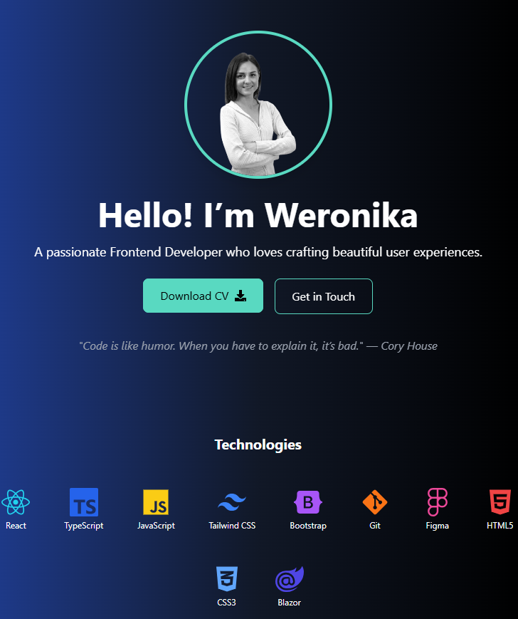

# 🌟 Weronika Martinsen Portfolio

Welcome to my portfolio! 🚀 This portfolio includes my 3 last projects.

---

## 🌐 Live Demo

👉 **[Visit My Portfolio](https://portfolio-martinsen.netlify.app/)**

---

## 🛠️ Tech Stack

- **Languages:** HTML5, CSS3, JavaScript (ES6+)
- **Frameworks & Libraries:** ReactJS, TypeScript, TailwindCSS
- **Tools:** Git, GitHub, Figma, Adobe XD
- **Other Skills:** Responsive Design, REST APIs, UI/UX Design

---

## 📂 Projects

Here are some of the projects featured on my portfolio:

### 1. [Portfolio Website](https://weronikamartinsen.netlify.app/)

- Custom-designed portfolio showcasing my work.
- Built with **ReactJS** and **TailwindCSS** for a clean, modern interface.

### 2. [GitHub Repository](https://github.com/weronikamartinsen)

- A collection of my frontend projects, including responsive layouts, interactive UI, and more.

---

## 🚀 How to Run the Project

Follow these steps to set up and run this project on your local machine:

### 1. Clone the Repository

Clone the project to your local machine using the following command:

```bash
git clone https://github.com/weronikamartinsen/portfolio.git
cd portfolio
```

### 2. Install Dependencies

Make sure you have Node.js installed on your system. Then, run this command to install all required packages:

```bash
npm install
```

### 3. Start the Development Server

Start the project in development mode with this command:

```bash
npm start
```

### 4. Build for Production

To create an optimized production build, run the following command:

```bash
npm run build
```

## 📈 Highlights

- 🚀 Developed 10+ fully responsive web applications.
- 📚 Proficient in **React**, **JavaScript**, and **TailwindCSS**.
- ✨ Skilled in designing modern UI/UX for diverse audiences.
- 🌐 Active on GitHub with a portfolio of practical projects.

## 🖥️ Screenshots



## 🤝 Contact Me

Looking to collaborate or hire? Feel free to reach out!  
📧 Email: [weronika.martinsen@gmail.com](mailto:wb3167@gmail.com)  
🔗 LinkedIn: [Weronika Martinsen](https://www.linkedin.com/in/weronikamartinsen)

---
